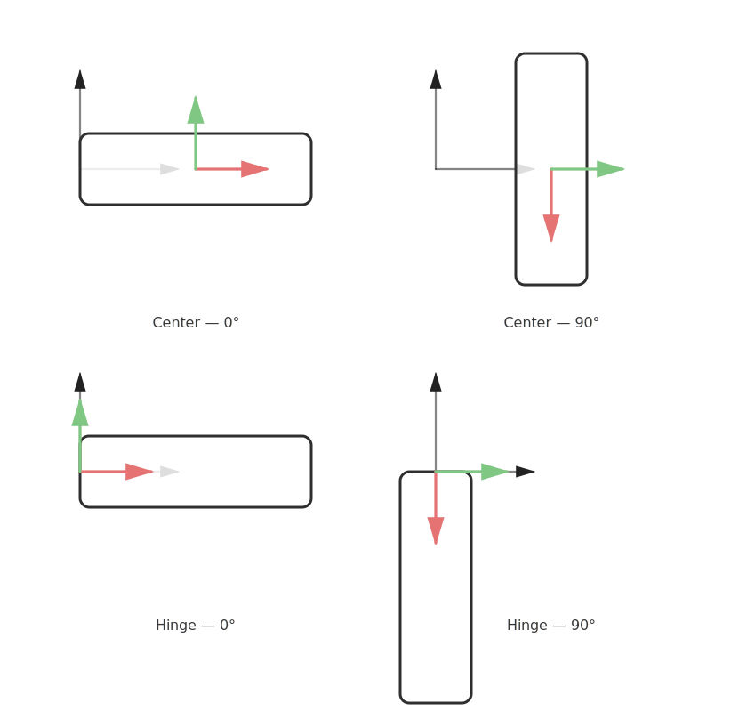
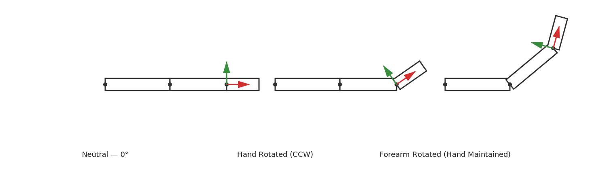
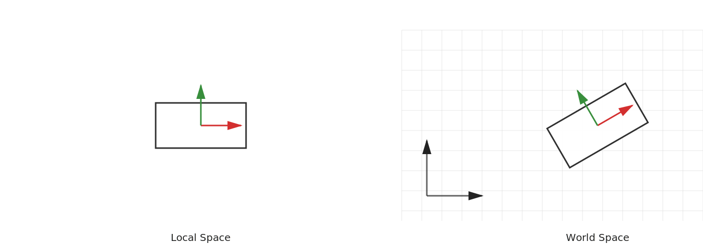
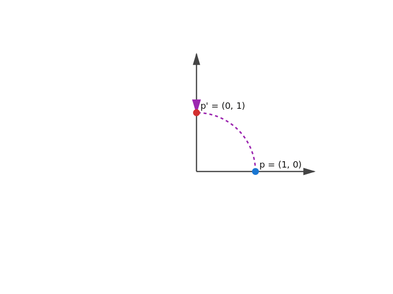

## 1. Coordinate Spaces

In mathematics, a coordinate space (or reference frame) defines:
- A point considered to be the **origin (0, 0, 0)**
- Three **perpendicular axes (x, y, z)** that define directions
- A unit scale for length (what "1 unit" means)

Any vector only has meaning given the **space** which it belongs to.
The same vector may refer to different physical locations depending on the space, as we will see next.

---

### Local/Object Space

Local space is the object's own coordinate system. It moves and rotates with the object. Think of it as a localized view of everything that may alter the object.

#### Key Properties
- The **origin is at the object’s pivot/center**. Note that this does not mean the center of the mesh/object. Sometimes its useful to define a 3D object to have its pivot be in one of the edges of the model. Think of a door - If we need to animate it open, then we should rotate it based off its hindge. If we rotate the door from its center, it won't rotate correctly. The following example shows a top-down view of a door being rotated from its center vs. from its hindge:

- Axes represent the object's own forward, right, and up directions.
- Scaling, rotation, and translation do not change the numbers of vertices in this space — they only change how local space maps to other spaces. If we decide to rotate the door from its hidnge, then the vertices on the handle of the door will change their position.

#### Why It Exists

Local space allows an object to be defined independently of where it is placed in the scene.
Modeling tools export geometry in local coordinates, so the same mesh can be reused anywhere with different transforms.

#### Example

Imagine a character’s arm. When the arm rotates, the hand should move with it.
If hand vertices were stored in world space, animation would be extremely complex.
Because they are stored in local space, rotating the hand means rotating its local frame — all points follow automatically.

---

### World Space

World space is the **global coordinate system** in which all objects are positioned, oriented, and interact within a scene.  
Every object’s local coordinates are transformed into world coordinates so they can coexist in a shared space.

#### Key Properties
- **Single Global Reference Frame**  
  The world has one origin and one set of axes (X, Y, Z). All objects and systems refer to this same coordinate frame.

- **Defines Object Placement in the Scene**  
  After you apply an object's local transformations (scale, rotation, translation), the resulting coordinates represent where the object exists in the world.

- **Allows Object Interaction**  
  Physics, collision detection, lighting, shadows, and spatial queries rely on world-space coordinates so objects can interact meaningfully.

- **Scene-Level Consistency**  
  Rendering engines, physics engines, and AI/navigation systems operate in world space to ensure consistent simulation and behavior across components.

#### Why It Exists

World space is required to place all independent objects into a unified scene.  
Without it, each object would exist only in its own local coordinate system, making interactions, rendering, and simulation impossible.

By converting objects into world space:

- A character can walk on terrain and collide with walls.
- Light sources can illuminate objects and compute shadows correctly.
- A camera can move around the scene and render objects relative to a common frame.

#### Example

A car model is created. We have the local space with the origin at the center of the model.
Now we take a step back, and position it in the world space - say with a slight rotation, and translation to the top right of the world origin.
The image below shows the difference:

===

## 2. Homogeneous Coordinates

Strange name huh? We will see what it represents in a second. But first, let's start from the simplest case - 2D.

### 2.1 Starting with 2D: Rotation Using Matrices

In a 2D Cartesian plane, a point is represented as:

$$
p = \begin{bmatrix} x \\ y \end{bmatrix}
$$

Certain transformations can be applied to this point using matrix multiplication. The first important example is **rotation**.

---

#### 2D Rotation

To rotate a point around the origin by an angle \(\theta\), we use the following rotation matrix:

$$
R(\theta)=
\begin{bmatrix}
\cos\theta & -\sin\theta \\
\sin\theta & \cos\theta
\end{bmatrix}
$$

:::spoiler[See explanation for that formula]

### Why the Rotation Formula Has This Form

#### 1. Represent a Point in Polar Form

Any point $(x, y)$ can be described using:

- its distance from the origin \(r\)
- its angle \(\alpha\) relative to the positive X-axis

$$
x = r\cos\alpha,\quad y = r\sin\alpha
$$

This is simply converting Cartesian to polar coordinates.

---

#### 2. Rotate the Point by an Angle $\theta$

Rotating the point counter-clockwise by $\theta$ increases its angle:

$$
\alpha' = \alpha + \theta
$$

The coordinates of the rotated point become:

$$
x' = r\cos(\alpha + \theta),\quad y' = r\sin(\alpha + \theta)
$$

---

#### 3. Expand Using Angle Addition Identities

Use the trigonometric identities:

$$
\cos(\alpha + \theta) = \cos\alpha\cos\theta - \sin\alpha\sin\theta
$$

$$
\sin(\alpha + \theta) = \sin\alpha\cos\theta + \cos\alpha\sin\theta
$$

Substitute $x = r\cos\alpha$ and $y = r\sin\alpha$:

$$
x' = x\cos\theta - y\sin\theta
$$

$$
y' = x\sin\theta + y\cos\theta
$$

---

#### 4. Convert to Matrix Form

Now express the transformation as a matrix multiplication:

$$
\begin{bmatrix}
x' \\ y'
\end{bmatrix}
=
\begin{bmatrix}
\cos\theta & -\sin\theta \\
\sin\theta & \cos\theta
\end{bmatrix}
\cdot
\begin{bmatrix}
x \\ y
\end{bmatrix}
$$

This matrix is the **2D rotation matrix**.

---

### Key Insight

The rotation matrix is not arbitrary; it is the algebraic form of a geometric fact:

- Rotating a point increases its angle by $\theta$, but keeps its distance from the origin constant.
- The cosine and sine terms come from converting between polar and Cartesian coordinates.
- The structure of the matrix ensures that the point’s length does not change — only its orientation.

This is why **rotation fits perfectly into a matrix multiplication**, making it easy to apply and combine with other transformations.

:::

Applying this matrix to a point performs the rotation:

$$
p' = R(\theta) \cdot p
$$

This is a purely multiplicative operation, which is powerful because:

- It allows applying rotations consistently to any vector.
- It can be chained with other matrix-based transformations.
- It keeps the math compact and efficient.

**Example:** rotating the point $(1, 0)$ by $90^\circ$ counter-clockwise:

$$
R(90^\circ)=
\begin{bmatrix}
0 & -1 \\
1 & 0
\end{bmatrix}
\quad\Rightarrow\quad
p' = \begin{bmatrix}0\\1\end{bmatrix}
$$

The point moves from the positive X-axis to the positive Y-axis, as expected:

---

### 2.2 Scaling in 2D

Scaling also fits naturally into matrix multiplication:

$$
S(s_x, s_y) =
\begin{bmatrix}
s_x & 0 \\
0 & s_y
\end{bmatrix}
$$

For example, scaling a point by 2 in both axes doubles its distance from the origin.

---

### 2.3 The Limitation: Translation Does Not Fit

Rotation and scaling can be expressed as matrix × vector operations.  
Translation cannot:

$$
p' =
\begin{bmatrix}
x + t_x \\
y + t_y
\end{bmatrix}
$$

There is no 2×2 matrix \(T\) such that:

$$
T \cdot p = p + t
$$

This creates a practical issue:

- Rotation and scaling can be chained through matrix multiplication.
- Translation requires addition.
- Mixing multiplication and addition complicates combining transformations.

If you want to scale, then rotate, then translate a point, you must apply each step separately.  
This makes it harder to **compose transforms** into a single reusable operation.

---

#### Why This Matters

Game engines, animation systems, and GPU pipelines often need to apply **many transformations at once**, possibly hundreds per frame. Ideally, all transforms should be composable in the form:

$$
p' = M \cdot p
$$

where \(M\) represents the entire accumulated transformation.

The limitation in 2D — that translation requires addition — is the motivation for extending the coordinate system.  
The next step will show how adding a third component in 2D (homogeneous representation) solves this elegantly.

---

### 2.4 Solving Translation in 2D with Homogeneous Coordinates

As we saw, the limitation in standard 2D coordinates is that translation requires addition, not multiplication.  
To overcome this, we extend 2D points from 2 components to **3 components**:

- A 2D point \((x, y)\) becomes \((x, y, 1)\)
- A 2D direction vector becomes \((x, y, 0)\)

This extended representation is called **homogeneous coordinates**.

---

#### Homogeneous Representation

A point in 2D homogeneous form is written as:

$$
p_h = \begin{bmatrix} x \\ y \\ 1 \end{bmatrix}
$$

The extra value `1` enables translation to be embedded inside a matrix.

---

#### Translation as a Matrix

With homogeneous coordinates, translation can be expressed as a **3×3 matrix**:

$$
T(t_x, t_y) =
\begin{bmatrix}
1 & 0 & t_x \\
0 & 1 & t_y \\
0 & 0 & 1
\end{bmatrix}
$$

Applying a translation is now a matrix multiplication:

$$
p'_h = T \cdot p_h
$$

Expanding:

$$
\begin{bmatrix}
1 & 0 & t_x \\
0 & 1 & t_y \\
0 & 0 & 1
\end{bmatrix}
\cdot
\begin{bmatrix}
x \\ y \\ 1
\end{bmatrix}
=
\begin{bmatrix}
x + t_x \\ y + t_y \\ 1
\end{bmatrix}
$$

This produces the translated point using multiplication only.

---

#### Rotation and Scaling Fit Too

Rotation in homogeneous 2D becomes:

$$
R(\theta)=
\begin{bmatrix}
\cos\theta & -\sin\theta & 0 \\
\sin\theta & \cos\theta & 0 \\
0 & 0 & 1
\end{bmatrix}
$$

Scaling becomes:

$$
S(s_x, s_y) =
\begin{bmatrix}
s_x & 0 & 0 \\
0 & s_y & 0 \\
0 & 0 & 1
\end{bmatrix}
$$

All transformations now have the same 3×3 structure.

---

#### The Power of Composition

Since translation, rotation, and scaling are all matrices of the same size, they can be **combined into a single transform matrix**:

$$
M = T \cdot R \cdot S
$$

Then applied in a single step:

$$
p'_h = M \cdot p_h
$$

This allows chaining of multiple transformations without mixing operations.

By adding one extra component and using 3×3 matrices, **every 2D transformation becomes a matrix multiplication**.  
This solves the translation issue and gives a unified, composable system for building complex transformations — essential for graphics, animation, and game engines.

The same idea extends naturally to 3D, where we add one more component and use 4×4 matrices to gain the same benefits there.

===

## 3. Transformation Matrices (4×4)

### 3.1 Translation

$$
T =
\begin{bmatrix}
1 & 0 & 0 & t_x \\
0 & 1 & 0 & t_y \\
0 & 0 & 1 & t_z \\
0 & 0 & 0 & 1
\end{bmatrix}
$$

### 3.2 Scaling

Uniform scale \( s \):

$$
S =
\begin{bmatrix}
s & 0 & 0 & 0 \\
0 & s & 0 & 0 \\
0 & 0 & s & 0 \\
0 & 0 & 0 & 1
\end{bmatrix}
$$

Non-uniform \( (s_x, s_y, s_z) \):

$$
S =
\begin{bmatrix}
s_x & 0 & 0 & 0 \\
0 & s_y & 0 & 0 \\
0 & 0 & s_z & 0 \\
0 & 0 & 0 & 1
\end{bmatrix}
$$

### 3.3 Rotation Matrices

Rotation about **x-axis**:

$$
R_x(\theta) =
\begin{bmatrix}
1 & 0 & 0 & 0 \\
0 & \cos\theta & -\sin\theta & 0 \\
0 & \sin\theta & \cos\theta & 0 \\
0 & 0 & 0 & 1
\end{bmatrix}
$$

Rotation about **y-axis**:

$$
R_y(\theta) =
\begin{bmatrix}
\cos\theta & 0 & \sin\theta & 0 \\
0 & 1 & 0 & 0 \\
-\sin\theta & 0 & \cos\theta & 0 \\
0 & 0 & 0 & 1
\end{bmatrix}
$$

Rotation about **z-axis**:

$$
R_z(\theta) =
\begin{bmatrix}
\cos\theta & -\sin\theta & 0 & 0 \\
\sin\theta & \cos\theta & 0 & 0 \\
0 & 0 & 1 & 0 \\
0 & 0 & 0 & 1
\end{bmatrix}
$$

### 3.4 Combined Transform

A full rigid transform with scaling, rotation, and translation is typically:

$$
M = T \cdot R \cdot S
$$

Order matters because matrix multiplication is **not commutative**.

---

## 4. Transform Chains

If an object has parent matrix \( M_p \) and local matrix \( M_l \):

Local → World:

$$
M_{world} = M_p \cdot M_l
$$

World → Local:

$$
p_{local} = M_{world}^{-1} \cdot p_{world}
$$

Hierarchies multiply like:  
Local → Parent → Parent’s Parent → … → World.

---

## 5. Euler Angles

Euler angles represent rotation as three sequential rotations, often around x, then y, then z. One common order:

$$
R = R_z(\gamma) R_y(\beta) R_x(\alpha)
$$

Limits:
- rotation order affects result
- can suffer **gimbal lock** (loss of one degree of freedom)
- poor for interpolation

---

## 6. Quaternions

A quaternion is:

$$
q = w + xi + yj + zk
$$

Rotation of angle \( \theta \) around a unit axis \( \vec{u} = (u_x, u_y, u_z) \):

$$
q = \cos\frac{\theta}{2} + (u_x i + u_y j + u_z k)\sin\frac{\theta}{2}
$$

### 6.1 Rotating a Vector with a Quaternion

Convert vector \( v \) into a quaternion with 0 scalar part:

$$
v_q = 0 + v_x i + v_y j + v_z k
$$

Apply rotation:

$$
v' = q \, v_q \, q^{-1}
$$

### 6.2 Quaternion to Rotation Matrix

$$
R(q) =
\begin{bmatrix}
1 - 2(y^2 + z^2) & 2(xy - wz) & 2(xz + wy) \\
2(xy + wz) & 1 - 2(x^2 + z^2) & 2(yz - wx) \\
2(xz - wy) & 2(yz + wx) & 1 - 2(x^2 + y^2)
\end{bmatrix}
$$

### 6.3 Quaternion Interpolation (Slerp)

$$
\text{Slerp}(q_0, q_1, t) =
\frac{\sin((1-t)\Omega)}{\sin \Omega} q_0 +
\frac{\sin(t\Omega)}{\sin \Omega} q_1
$$

where \( \Omega = \arccos(q_0 \cdot q_1) \).

---

## 7. Transforming Normals

Normals must be transformed differently than points if scaling or shearing exists.

Given transform matrix \( M \):

Normal transform uses **inverse-transpose** of the upper-left 3×3:

$$
n' = (M^{-1})^T n
$$

Then normalize.

---

## 8. Change of Basis

If basis vectors of coordinate system A are stored in matrix \( B_A \) and of system B in \( B_B \):

To convert a vector from A to B:

$$
v_B = B_B^{-1} B_A v_A
$$

This is the math behind converting between coordinate spaces.

---

## 9. Summary

- Use **4×4 matrices** for translation, rotation, scaling in one representation.
- **Euler angles** are intuitive but have singularities and ordering issues.
- **Quaternions** offer robust rotation representation and smooth interpolation.
- Local-to-world transformations are matrix multiplications up a hierarchy.
- Normals require **inverse-transpose** transformation.
