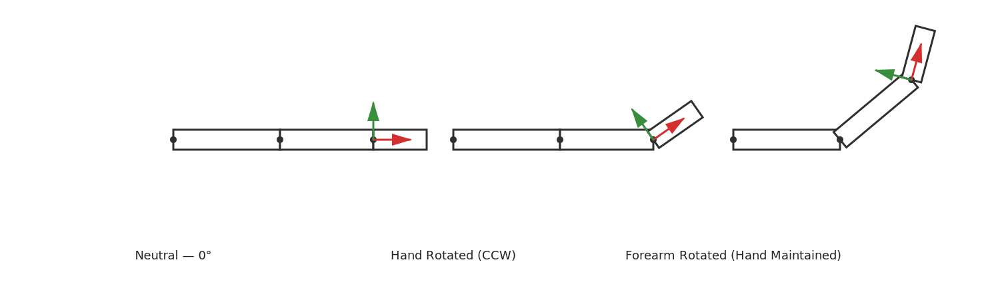

# 1. Coordinate Spaces

In mathematics, a coordinate space (or reference frame) defines:

* A point considered to be the **origin (0, 0, 0)**
* Three **perpendicular axes (x, y, z)** that define directions
* A unit scale for length (what "1 unit" means)

Any vector only has meaning given the **space** which it belongs to.
The same vector may refer to different physical locations depending on the space, as we will see next.

---

## 1.1 Local/Object Space

Local space is the object's own coordinate system. It moves and rotates with the object. Think of it as a localized view of everything that may alter the object.

### Key Properties

* The **origin is at the object’s pivot/center**. Note that this does not mean the center of the mesh/object. Sometimes its useful to define a 3D object to have its pivot be in one of the edges of the model. Think of a door - If we need to animate it open, then we should rotate it based off its hindge. If we rotate the door from its center, it won't rotate correctly. The following example shows a top-down view of a door being rotated from its center vs. from its hindge:

* Axes represent the object's own forward, right, and up directions.
* Scaling, rotation, and translation do not change the numbers of vertices in this space — they only change how local space maps to other spaces. If we decide to rotate the door from its hidnge, then the vertices on the handle of the door will change their position.

### Why It Exists

Local space allows an object to be defined independently of where it is placed in the scene.
Modeling tools export geometry in local coordinates, so the same mesh can be reused anywhere with different transforms.

### Example

Imagine a character’s arm. When the arm rotates, the hand should move with it.
If hand vertices were stored in world space, animation would be extremely complex.
Because they are stored in local space, rotating the hand means rotating its local frame — all points follow automatically.

---

## 1.2 World Space

World space is the **global coordinate system** in which all objects are positioned, oriented, and interact within a scene.\
Every object’s local coordinates are transformed into world coordinates so they can coexist in a shared space.

### Key Properties

* **Single Global Reference Frame**\
  The world has one origin and one set of axes (X, Y, Z). All objects and systems refer to this same coordinate frame.

* **Defines Object Placement in the Scene**\
  After you apply an object's local transformations (scale, rotation, translation), the resulting coordinates represent where the object exists in the world.

* **Allows Object Interaction**\
  Physics, collision detection, lighting, shadows, and spatial queries rely on world-space coordinates so objects can interact meaningfully.

* **Scene-Level Consistency**\
  Rendering engines, physics engines, and AI/navigation systems operate in world space to ensure consistent simulation and behavior across components.

### Why It Exists

World space is required to place all independent objects into a unified scene.\
Without it, each object would exist only in its own local coordinate system, making interactions, rendering, and simulation impossible.

By converting objects into world space:

* A character can walk on terrain and collide with walls.
* Light sources can illuminate objects and compute shadows correctly.
* A camera can move around the scene and render objects relative to a common frame.

### Example

A car model is created. We have the local space with the origin at the center of the model.
Now we take a step back, and position it in the world space - say with a slight rotation, and translation to the top right of the world origin.
The image below shows the difference:

\===

# 2. Scene Hierarchies & Parent–Child Transforms

Real scenes are made of objects that depend on each other. A character is not a single mesh; it is a body holding an arm, an arm holding a hand, and a hand holding an object. To manage these relationships, graphics systems organize objects into **hierarchies**, often called a *scene graph*. Each object in the hierarchy defines its own **local transform**, describing where it is relative to its parent.

## 2.1 Why Use Hierarchies?

The core idea is simple: **children inherit the transformations of their parents**.\
If the parent moves, rotates, or scales, the child follows automatically.

This solves a major complexity problem. Without hierarchies, every object would need to track its world position directly. If a parent object moved, all dependent objects would require manual updates. Hierarchies avoid this by allowing each object to define itself in the parent’s space, making motion propagation automatic and efficient.

### Example

A character’s skeleton illustrates this well:

* The **body** defines the top-level space for the character.
* The **upper arm** is positioned relative to the shoulder.
* The **forearm** is positioned relative to the elbow.
* The **hand** is positioned relative to the wrist.
* A **sword** is attached to the hand.

Animating the arm (e.g., waving) should move the hand and sword, even though their own local transforms never changed. The sword only needs to know where it sits in the hand’s local space; the rest is inherited through the hierarchy.

## 2.2 Local Space in a Hierarchy

In this context, *local space* gains a more practical meaning: it is not just the object’s internal coordinate system — it is the coordinate system **in which the object is placed relative to its parent**.

Key observations:

* The child’s origin and axes exist *inside the parent’s coordinate system*.
* Rotating the parent rotates the child’s axes.
* Scaling the parent scales the child’s local space as well.
* A good pivot choice matters, because it defines how the object responds to inherited transforms.

This is why tools like 3D modeling software and game engines expose pivot settings and parent–child linking as core features.

## 2.3 Where Hierarchies Appear

This pattern is universal across multiple domains:

| Domain | Example of Parent → Child |
|--------|-----------------------------|
| Characters | Body → Arm → Hand → Weapon |
| Vehicles | Car body → Wheel → Wheel nuts |
| Cameras & Attachments | Drone → Gimbal → Camera |
| UI | Window → Panel → Button → Icon |

Each level defines a new coordinate space. Children are expressed relative to that space rather than to the world.

## 2.4 Key Mental Model (Before the Math)

Before introducing matrix multiplication, the fundamental concept to internalize is:

> **An object does not know its world position. It only knows its position relative to its parent.**

To determine the object’s final world position, we must **step through the chain of parents**, converting from one space to the next until reaching world space.

The next sections will start by introducing some basic matrix operations, and their order of operation. We will later see how all these transformations unfold in terms of matrices.

\===
