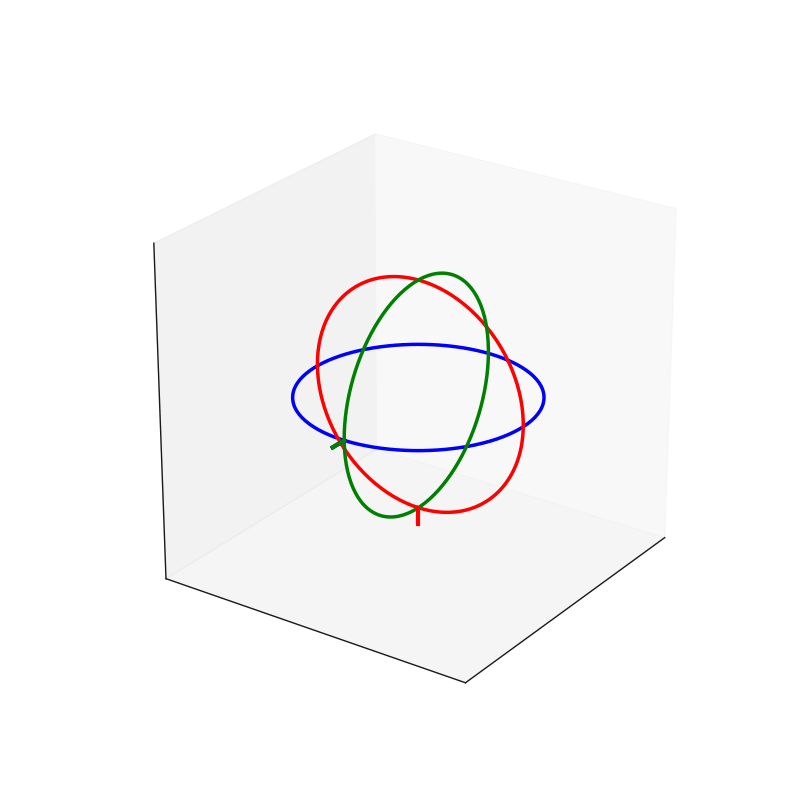

Rotations in 3D can be represented in multiple ways. The two most common are **Euler angles** and **quaternions**. Both describe orientation, but they behave very differently and are suited for different purposes.

This section explains when Euler angles are appropriate, their limitations, and how quaternions solve those limitations.

---

# 1 Euler Angles

Euler angles express rotation as three sequential rotations around the coordinate axes (e.g., X → Y → Z). They are simple, intuitive, and easy for humans to understand.
You specify rotations one at a time:

1. Rotate X 30º
2. Rotate Y 20º

Euler angles are a good choice when:

* You need a **user-friendly** way to specify orientation\
  (e.g., in an editor: `(30°, 0°, 90°)`)
* Rotations occur around **one axis at a time** (e.g., a camera looking up/down)
* You want a **compact and readable** representation
* You are doing a 2D application

Common examples:

* Rotation fields in Unity/Unreal/Blender inspectors
* Camera yaw/pitch controls
* Simple mechanical rotations (doors, wheels, turrets)

Euler angles match how people naturally describe orientation:\
“Turn 45° left, then tilt 15° up.”

---

## 1.2 Limitations of Euler Angles

Euler angles are not ideal for continuous 3D rotation or animation. They suffer from three core issues.

### 1.2.1 Rotation Order Dependency

Euler rotations are applied **sequentially**, one axis at a time. Changing the order produces different results:

* Rotating X → Y → Z is **not the same** as Z → Y → X

Different engines use different orders, which creates confusion and bugs.

### 1.2.2 Gimbal Lock

Gimbal lock occurs when one rotation causes two axes to align, eliminating a degree of freedom.\
The object can no longer rotate freely.

**Example:**\
Imagine we have a scene graph where the **blue** (Yaw) axis is the parent, then red axis is a child, and green axis (Roll) is the child of red:

```
> Blue (Yaw)
   |- Red
       |- Green (Roll)
```

If we rotate the green and blue such that they align, we are only able to rotate over 2 axis instead of 3, because we essentially lost 1 axis of rotation.



### 1.2.3 Poor Interpolation

Interpolating Euler angles directly (e.g., linear interpolation) causes:

* Jerky or unnatural motion
* Sudden flips near angle boundaries (e.g., going from 359° to 0°)
* Non-uniform rotation speed

Euler angles do not interpolate smoothly because the shortest rotation path is not linear in Euler space.

See this gif below:


In this case, we have an arrow model pointing up, and we want to rotate it to point to us.
Conceptually we should only need to rotate it in the **right** direction relative to the camera.
The problem is that in this example we have the green and blue axis **locked**. So we cannot rotate it using this (the direction to the right relative to the camera) axis.

We can still end up with the arrow pointing to us, but it will produce an unwanted curved path instead of straight.
If this scales up to more complex animations, we can see how it would break most animations.

There's [this](https://www.youtube.com/watch?v=zc8b2Jo7mno) really great video explaining gimball lock (where this last gif was taken from).

---

# 2. Quaternions

Yes, the **Quat** part means four (comes from the latin *quaternio*, meaning *"set of four things"*). In our case, four dimensions.
Don't get freaky. We all know our brains are not suited to conceptualize 4D space, so I will take a more natural approach.

First we will see what problems they solve. Only then we will build an intuition of why we need 4 dimension for rotations in a 3D space.

## 2.1. What are they and what do they solve?

Quaternions encode rotation in 3D space, and are represented in four components. While less intuitive at first glance, they provide mathematical properties ideal for 3D motion. Here are some of the problems we saw in Euler angles that no longer happen under quaternions:

### 2.1.1. No Rotation Order Problem

A quaternion represents a **single unified rotation**, not three sequential axis rotations.\
There is no concept of rotation order, so composition is consistent and predictable. We can be sure that $R\_x(\theta) \rightarrow R\_z(\theta) = R\_z(\theta) \rightarrow R\_x(\theta)$

### 2.1.2 Immune to Gimbal Lock

Quaternions operate in 4D space. Their representation never collapses axes together, so they never lose a degree of freedom.\
All orientations remain valid with full control over 3D rotation.

### 2.1.3. Smooth Interpolation (Slerp)

Quaternions support **Spherical Linear Interpolation (Slerp)**, which moves along the shortest path on a sphere:

* Smooth, natural rotation
* Constant speed
* No snapping or flipping

This makes them ideal for animation, camera movement, and physics. That case we saw in the arrow gif above, you can forget about such issues. Will never happen.

### 2.1.4. Numerical Stability

Repeated Euler rotations accumulate floating-point error, causing tilt and drift over time.\
Quaternions preserve orthogonality and remain stable even after many rotations (when normalized).

## 2.2. Building an intuition for Quaternions

Okay, now you know that this special black magic box - quaternion - solves the rotation issues. But what is it exactly, right? How is it built? what is its meaning?
To understand all this, we need to take a step back, and think how rotations work, and at its essence what rotations really are.

### 2.2.1. Duoternians

Let's focus on the 2D plane. Why? It's the smallest space that allows for rotations. If you doubt it, try to think how a rotation would happen in 1D.
Well, you can only move either forward or backward. you cannot rotate. For that to happen, you (suposing somehow you had eyes) would need to update where you were looking at continuously until you pointed in the oposite direction. But as you can see, this requires an additional dimension. If you are looking forward, and want to rotate to be looking backwards, you would either turn yourself from the right, left, up or down (weirdo).

So, back to 2D. What is a rotation? You can intuitively see a triangle in a 2D plane, and rotate it 45 degrees clockwise.
What this means actually is the following:

1. There is an invisible axis perpendicular to the 2D plane, call it **z**
2. We perfom a rotation over that axis over 45 degrees (use the right-hand rule)

So a rotation in 2D is really a rotation over an axis perpendicular to 2D plane - i.e, an axis in 3D space, and a 1D rotation (a single number - the angle).
One interesting thing, is that this rotation axis is fixed - is always the same for any possible 2D rotation. Why? Well, we only have 2 axis - **x** and **y** defining our 2D space, which is a plane. The only rotational axis (which by definition needs to be perpendicular to the plane we want to rotate) is the one perpendicular to this plane - **z**.

Now here enters the boring part - complex numbers.
You may know that we may represent 2D rotations as complex numbers (to continue)

### 2.2.2. Triternians..?

So, if 2D rotations can be encoded in a 2-element structure - complex numbers, and 2D rotations are done over a 3D-space axis, that means 3D rotations require a 3-element structure, and 3D rotations are done over a 4D-space axis, right???

Not so fast.
There is a very big difference between 2D and 3D spaces that people don't usually build the intuition for. Our first instinct when doing progressions like this is to assume they are linear. In this case its not.

You see, a 2D space has a single plane - which means a single axis of rotation. In theory, we should specify a rotation by **its axis plus the rotation over it**. But for 2D, since the axis is always the same, we can omit it, and just specify the rotation.

For 3D however, there is not a single fixed axis of rotation. In fact, there are infinite!
In 3D we have 3 axis - **x**, **y** and **z**. So if we take any of those 3 unit axis as the axis of rotation, we end up with a plane made of the other 2 axis. Meaning we have at least 3 base planes which we can use for rotations.
What if we want to use a different plane and axis?
Give it some thought. How many possible planes are there? This is the same as asking - how many possible rotation axis are there? Or put in more simply - How many possible 3D vectors are there? You can see where I'm getting - Infinite.

So with a 3-value structure (x, y, z) we can only get the axis of rotation. We must extend it to also include the **rotation angle** over that axis.
Pling! this is a 4-value structure! The so-glorified 4D Quaternion!

I challenge you to do a simple exercise. Keep this mental model of an axis of rotation and the plane perpendicular to it, and try to rotate your phone with your hand. Try to see how this is true.

Of course some of you will continuously change the axis of rotation and call it BS! Fair enough.
You see, for simple rotations of the type *"I want to rotate this object from this original position into that final position"* - such cases use only 1 fixed axis, and rotation angle.

But for more complex animations, where we need to update our rotation continuously, the axis is **no longer fixed**. Meaning the axis also continuously changes. But for each timestep the axis is assumed to be fixed. So the model of **constant 3D rotation axis + rotation angle** holds for any rotation.

# 3. Best Quaternion resources

* [Interesting ways to project 3D space into 2D](https://en.wikipedia.org/wiki/List_of_map_projections)

---

### 6.5 Practical Rule of Thumb

* **Use Euler angles for input, UI, simple rotations, and user-facing values.**
* **Use quaternions for actual rotation math, animation, physics, interpolation, and continuous 3D movement.**

Most engines expose Euler angles to the user for convenience, but internally convert them to quaternions to perform rotation computations correctly and avoid gimbal lock.
