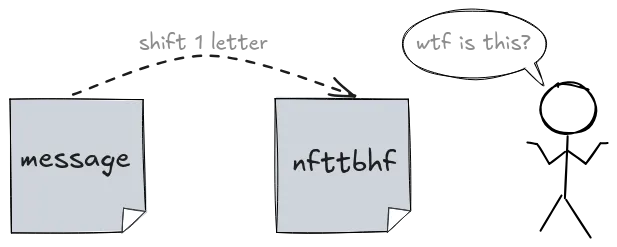
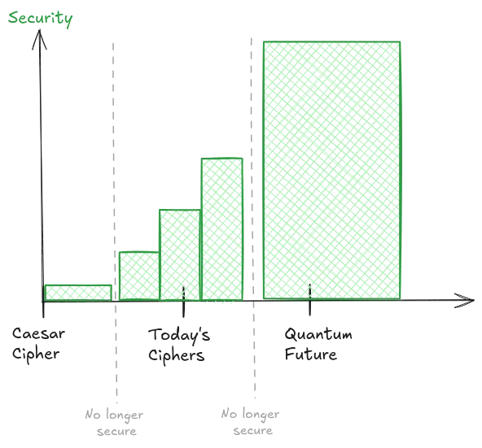
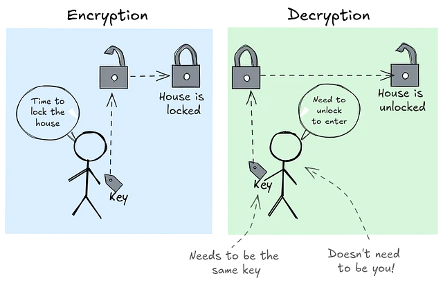
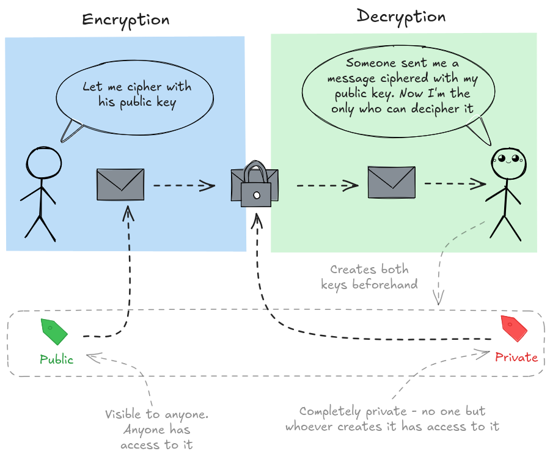
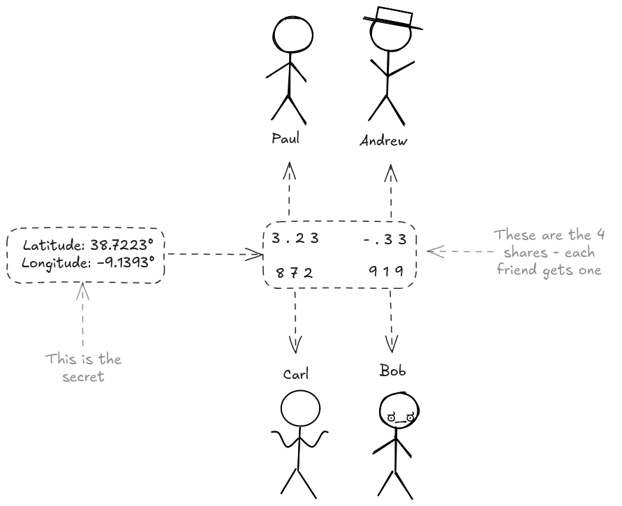

# 1.  Caesar Salad of Secrets: A Recipe for the First Cipher

Since ancient times, people have needed to keep important information hidden from prying eyes. Whether it was a king's secret orders or a merchant's trade routes, secrecy was often the difference between safety and disaster.

Sometimes I like to imagine a world where everyone has good intentions. In such a world, I could write my safe's password on a piece of paper, leave it in the town square, and trust that nobody would misuse it. But history shows us this is nothing more than a fairy tale. People have always had competing interests, and information has always needed protection.

## Enter the Caesar Cipher

Roman generals - most famously Julius Caesar - used one of the earliest forms of secret writing: the Caesar cipher. It was simple but effective for its time.
Here's how it worked:

* Take each letter in the message.
* Shift it by a fixed number of positions in the alphabet.
* Share the "secret sauce" - the shift amount - only with those allowed to read the message.

Without knowing the shift, anyone intercepting the message would see only gibberish.

But there was a catch. **Patterns** - such as the repeated letter 't' in the message above - can still give attackers clues. And given enough time, they could try all possible shifts and eventually break the code.

This is what ciphering is all about: transforming information into a secure state so that, without the secret key, recovering the original message is computationally infeasible within some lifetime.

Woof… That's a big definition. Let's unpack it:

1. **Security** - A cipher is only secure if it doesn't leak additional information beyond scrambled characters. This means it should not expose any patterns, repetitions or hints that may help attackers.
2. **Lifetime** - A cipher security always depends on some lifetime. More concretely, on how long it takes for someone to try out all possible keys to check if it deciphers the message. It is easy to see that Caesar's cipher was arguably safe at the time because:

   **a)** People were not that clever at breaking patterns\
   **b)** People weren't that fast at decoding

   Today, with computers, Caesar's cipher can be broken in milliseconds (the time it takes you to blink). It survives only as a teaching tool - a first step into the world of cryptography.
   This also means that today's ciphers will eventually become obsolete in the future.

And as a warning: today's ciphers will eventually become obsolete too.

# 2. One Key to Rule Them All (Symmetric Ciphers)

After Caesar's cipher, people kept improving the same basic idea: **one key to encrypt, the same key to decrypt**. That's why they're called *symmetric* ciphers - encryption and decryption are mirror images of each other.

* Sender and receiver agree on a **shared secret key** beforehand.
* Anyone who gets the key can read all the messages.

Think of it like the keys to your house. If you give someone the key, they can go inside - and if a thief steals the key, there's a pretty good chance you'll arrive at your house with no furniture.

Over the centuries, symmetric ciphers evolved from Caesar's simple letter shifts to complex machines like the Enigma in World War II. But the fundamental problem stayed the same: how do you share the key securely in the first place?

Because if an enemy intercepts the key… game over.

# 3. I know, You Don't! (Asymmetric Ciphers)

This key-sharing nightmare set the stage for a revolution. In the 1970s, mathematicians invented **asymmetric cryptography**, flipping the entire script.

Here's the magic trick:

* Each person now has **two keys**.
* A **public key**, freely shared with the world.
* A **private key**, kept secret.

Ok, I got 2 keys. What now? If I want to send you a secret:

1. I use your public key to lock the message.
2. Only your private key can unlock it.

This scheme is somehow similar to a Facebook account. If I want to send you a message, then I send it to your **public** account. Then only you can see it using your **private** password to log in.

Don't forget - I use **your public** key to **encrypt** (messages **sent to you**). I use **my private** key to **decrypt** (messages **sent to me**).

Now there's **no need to secretly exchange keys first**. You can shout your public key from the rooftops (your Facebook profile visible to everyone), and nobody can use it to read your messages - only to send you encrypted ones.

This leap made **modern cryptography** possible: secure websites (HTTPS), encrypted emails, digital signatures… the entire internet depends on this idea that I know something you don't, and that secret stays mine. It may seem like the holy grail of encryption has been reached - only you hold the secret key, and your ciphertexts cannot be deciphered unless you reveal it.

## Great! Or is it..?

This works perfectly if you **unilaterally** decide when to decrypt data sent to you. But as systems evolve, this power has its limits.

Here's a simple example of the shortcomings of both approaches we've seen so far. Imagine a group of friends that discovered a treasure map. They decide to go after the treasure in 2 months from now, and they let each one get part of a number of the coordinates. This simply means that Paul alone can't know where exactly the treasure is if he only gets part of the longitudinal coordinate. They do this such that only if they are all together again, they can go and retrieve the treasure.

At this point, the friend group has to decide - Should they let the splits be in plaintext? If they do this, anyone running by could see that coordinate share. Anyone close to Paul could start searching. Maybe his sister tells Carl's sister and they both start looking for it in their backs.. Then they could merge their secrets and get the full Latitude coordinate.

If they encrypt the split parts however, no one will be able to see anything from the splits. Meaning no one will be able to collect any coordinates, and thus, no merging will reveal any useful information. This seems a much safer solution! Let's try to accomplish this with the two encryption schemes we've covered:

1. **Symmetric Key** - If everyone shares the same key, then anyone can both encrypt and decrypt messages. That means Paul can decrypt Carl's share without his permission… Doesn't seem right! Paul could go to their homes in secret and decrypt everyone's share without them even knowing… 
   What if each friend had a unique shared key with every other friend? That is, Paul and Carl would have a P-C key, Andrew and Paul would share an A-P key, and so on. Well, that would prevent a single key from unlocking all messages, but now, how to choose the right key to cipher Paul's key? should it be P-C? or P-A? or maybe P-B? This doesn't seem to work.

2. **Asymmetric Key** - What if each grandson held a pair of keys - a public one and a private one? Each coordinate share would be encrypted with each friend's public key - meaning only that friend could decrypt it. Everyone agrees to only decrypt their share at the meetup. Looks promising!

   But hold on - Paul can still immediately see its coordinate share… What if he joins with Bob? Then they could both still join their shares and get the longitudinal coordinate.. What if 3 of them join? We cannot simply trust each grandson to keep their promise of not decrypting until they are all together. This won't work!

Clearly, solution (2) is better than (1), since the power of showing a coordinate share now belongs to each grandson. But we can do better. What if I told you, we could ensure all shares are kept secret until everyone gets together for Edna's birthday?

This is what Threshold Encryption is all about - encryption controlled by the group.

# 4. Threshold Encryption - No One Knows Until We All Do

The base idea is simple:

> Instead of one person knowing the secret, or even part of it, no one knows the full secret - and it only gets revealed when a group agrees to do so.

This means a few things:

1. There is a main secret
2. The main secret is not known by any single friend
3. Each friend gets a share - a ciphered part of this main secret
4. The main secret is recoverable by merging all shares
5. The coordinates for the map can only be deciphered using the main secret
6. We can define how many friends are needed for the merging step

So.. what does this mean in practice? - Well, this means that the group of friends initially produces 4 shares - one for each friend. **Each share is ciphered** - So Paul cannot go rogue trying to get parts of the coordinates of the treasure from his friends, because none of the parts are visible.

**Only when all friends decide to join** their parts together, **they can all see** the fully reconstructed **coordinates**. At this point, all of them see it, and all of them know where the treasure is.

So they can be sure that it is impossible for any subset of the friend group to get the coordinates. Only when the full group is present they can get the coordinates.

## From Example to Reality…

This is a simple example of course. In reality the process differs slightly.

There are two main differences from the example above to what really happens:

1. Each participant is assigned a **partial private** and **partial public key**.
2. There is not really a ciphered share that is given to each friend - as in step (3). Instead, each participant gets the exact same ciphered main secret, and computes their own share using their partial private key
3. The ciphered main secret is achieved by ciphering the coordinates using the group's common public key - which is the result of merging all participant's partial private keys

We've also introduced a broadcasting step. This is essentially each friend sending his share to each other, so that they all gather all shares and are able to merge.

In our simple example we didn't need this, since we assumed all friends shared their share at one point - when they meet again. But in real world systems, we cannot rely on timing assumptions like this. Thus, we rely on each participant to broadcast its share as soon as it is computed.

Then, instead of having one friend gathering all the shares, and merging them in a single point in time and space, we have each friend gathering all 4 shares in slightly different times, and each merges the received shares independently.

You might think: doesn't this mean one person could learn the secret before the others? Yes, that's true. Threshold encryption guarantees that the secret stays hidden unless enough shares are combined, but it does not enforce fairness in when everyone learns it. If fairness is required, extra protocol layers are needed to ensure simultaneous revelation.

---

And that's threshold encryption in a nutshell - secrets revealed only when the group agrees. Got questions or ideas? Drop them in the comments!
